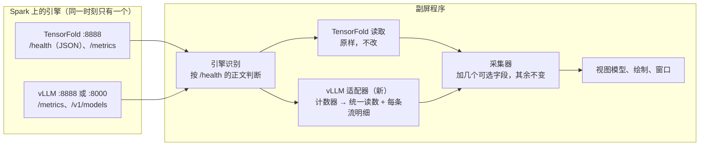

# 支持 vLLM · 设计文档（`design.md` 的增补，第一阶段）

> 2026-10-06。已实现并在乙上实测，结果见文末“实测结果”。界面上的两处选择见“已定事项”，原型 `dashboard-prototype.html` 已按本文改好。
> 同日用乙录了 10 段计数器序列（`fixtures/vllm/`），把适配器的规则在这些序列上逐条核对过，据此修正了三处：处理顺序、起点回推的条件、推测解码计数器的口径（文中标“实测修正”）。
> 本文只写“在现有程序上加什么、改什么”。没提到的地方全部照 `design.md`，TensorFold 这条路的行为一个字不变。
> 本文与 `design.md` 冲突时，vLLM 相关的以本文为准。

## 背景与目标

Spark 上的推理引擎不再固定是 TensorFold，会在几套部署之间切换。目标：

- 副屏程序自动识别当前是哪种引擎，切换引擎不用改配置、不用重启副屏程序。
- TensorFold 仍然完整支持，行为和现在完全一样。
- vLLM 第一阶段**不写容器内外挂**，只读 vLLM 自带的 `/metrics`。

本阶段不做：

- vLLM 的容器内外挂（预填充的真实进度只有它能给，见“已知限制”）。
- 修改任何一套部署仓库或启动参数。

## 实测环境

两套 vLLM 都通过 `ssh spark` 实测过，各发了 9–13 个请求（短请求、2.5 万和 4 万 token 的长提示、接着长提示追问、三路和五路并发、解码中途断开、预填充中途断开）。

| 项目 | 甲（2026-10-05） | 乙（2026-10-06） |
| --- | --- | --- |
| 容器 | `vllm-fn-tp1` | `qwen38-flash-next` |
| 镜像 | `vllm/vllm-openai:qwen38-flash-next`（开发版 + 部署仓库挂进去的补丁文件） | `myllmbox/qwen38-flash-next-vllm:v5.2`（vLLM 0.30.0 + 补丁） |
| 部署目录 | `~/Qwen3.8-Flash-Next-Single-DGX-Spark` | `~/models/qwen38-flash-next-recipe` |
| 模型 | NVFP4 量化，模型名 `qwen3.8-flash-next` | INT4 AutoRound 量化，模型名 `Qwen/Qwen3.8-Flash-Next` |
| 网络和端口 | host 网络，**8888** | bridge 网络，映射到主机的 **8000** |
| 并发上限 | 4 | 16 |
| 每步最多预填充 | 2,048 token | 8,192 token |
| 上下文上限 | 262,144 | 262,144 |
| 加载时间 | 约 11 分钟 | 约 9 分钟 |
| 单流解码 | 34–37 tok/s | 约 45 tok/s |
| 并发解码合计 | 3 路约 84 tok/s | 5 路约 121 tok/s |
| 预填充 | 约 1,780 tok/s | 2,200–2,500 tok/s |

两套的差别说明：端口、并发上限、每步预填充量、模型名的写法都不能写死。其中并发上限和每步预填充量在 `/metrics` 里读不到。

现有的两套仪表盘刻度（解码 0–300、预填充 0–3K）对两套 vLLM 都够用，不改。

## vLLM 能读到什么（实测结论）

`/health` 返回 200，正文是空的，只能用来判断“活着”。数据全在 `/metrics`（Prometheus 文本，约 65 KB、690 行）。复用连接读一次：中位 5–6 毫秒，95% 在 7.5 毫秒以内，出现过一次 147 毫秒。

下表的“什么时候更新”决定了面板能做到什么，是本设计的依据。每个指标都带 `engine`、`model_name` 等标签，解析时把同名的各行加起来。

| 指标（都以 `vllm:` 开头） | 含义 | 什么时候更新 |
| --- | --- | --- |
| `num_requests_running` | 引擎里在跑的请求数（预填充和解码都算） | 每个引擎步结束时。新请求要等它的**第一步算完**才计入 |
| `num_requests_waiting` | 排队数 | 同上 |
| `prefix_cache_queries_total` | 提示 token 数的累计 | 请求**开始调度时**（乙实测；甲未核实） |
| `prefix_cache_hits_total` | 缓存命中 token 数的累计 | 同上 |
| `prompt_tokens_total`、`prompt_tokens_cached_total` | 提示、缓存命中的累计 | 请求**出首字时** |
| `time_to_first_token_seconds_sum`、`_count` | 首字时间（从请求到达 API 算起） | 出首字时 |
| `generation_tokens_total` | 输出 token 累计 | 解码中每个引擎步（50 毫秒采样下每次都在变） |
| `request_success_total`（各 `finished_reason` 相加） | 正常结束的请求数 | 请求结束时 |
| `request_prompt_tokens_sum`、`request_generation_tokens_sum` | 已结束请求的提示、输出之和 | 请求结束时 |
| `request_prefill_kv_computed_tokens_sum` | 已结束请求的新算 token（提示 − 缓存命中）之和 | 请求结束时 |
| `request_prefill_time_seconds_sum`、`request_decode_time_seconds_sum` | 已结束请求的预填充、解码秒数之和 | 请求结束时 |
| `spec_decode_num_draft_tokens_total`、`spec_decode_num_accepted_tokens_total` | 草稿、被接受的 token | 解码中实时 |
| `process_start_time_seconds`（不带 `vllm:` 前缀） | API 进程的启动时刻 | 不变，引擎重启后换一个值 |

所有数值和接口返回的 `usage` 核对过，完全一致。另外确认了三件事：

- **预填充进度读不到。** `kv_cache_usage_perc` 在预填充期间会变，但每个请求有固定的起步占用（甲 18 块、乙 6 块），每块 1,466 或 2,924 token，增量忽大忽小，结束时还会回落，换算不成 token。“引擎步数”类的计数在纯预填充期间不动。
- **请求到达有延迟。** 新请求要等第一步算完才出现在 `/metrics` 里，延迟 = 分词时间 + 第一步的时间：

  | 情况 | 甲 | 乙 |
  | --- | --- | --- |
  | 短请求 | 约 0.2 秒 | 约 0.15 秒 |
  | 2.5 万 token，几乎全部命中缓存 | 0.4 秒 | — |
  | 1.1 万 token 从头算 | — | 2.5 秒 |
  | 2.5 万 token 从头算 | 2.0 秒 | — |
  | 4 万 token 从头算 | — | 5.1 秒 |
  | 4.8 万 token，其中 1.25 万新算 | — | 2.8 秒 |

- **中途断开的请求不算“结束”。** 解码中断开：在跑数 80 毫秒内归零，`request_success_total` 不变，已输出的 token 留在 `generation_tokens_total` 里。预填充中断开：引擎把手上这一步算完才放手（甲 0.4 秒、乙 2.6 秒），`prompt_tokens_total` 不变，但 `prefix_cache_queries_total` 已经加过了。

还有一个引擎自身的现象，面板会如实显示：**长预填充会压住同时在跑的其他请求。** 两套都一样：一条正在解码的流，在别的请求预填充的 7–11 秒里只出了 11–19 个 token；同时进来的 56 token 短请求等了 7–9 秒才出首字。这段时间副屏是“解码中”，速度约 2 tok/s。

## 整体做法

在“读接口”和“采集”之间加一层引擎适配，把两种引擎的读数变成同一种格式。采集器吃的仍然是 TensorFold `/health` 那种字典，vLLM 的读数由适配器换算成这种字典，并且**合成出和 TensorFold 外挂同样格式的每条流明细**。这样采集器里经过实机验证的那条主路径两种引擎共用。



| 组件 | 改动 |
| --- | --- |
| 读取（`panel/sources.py`） | 加一个 vLLM `/metrics` 解析函数；`/v1/models` 多读一个 `max_model_len` |
| 引擎适配（新，`panel/engine.py`） | 引擎识别；vLLM 适配器；对外只有一个“读一次”的入口 |
| 采集（`panel/collector.py`） | 认几个可选字段（见“采集器的改动”）；没有这些字段时行为不变 |
| 今日用量（`panel/usage.py`） | 认“引擎启动标记”，用来判断引擎换过或重启过 |
| 轮询（`panel/poller.py`） | 读取改成调引擎适配的入口；频率不变 |
| 视图模型、绘制 | 估算版预填充画面的几处文字；离线提示文字；模型名去掉斜杠前缀；空闲和离线时标出引擎 |
| 配置 | 接口地址改成一个列表 |
| 外挂（`hook/`、`scripts/hook.sh`） | 不改，仍然只对 TensorFold 有效 |

引擎适配和采集、读取一样只用标准库，不读时钟（时刻由调用方传入），同样的输入序列得到同样的输出，测试在 MacBook Pro 和 Spark 上都能跑。

## 引擎识别

配置里的接口地址是一个列表，默认 `http://127.0.0.1:8888`、`http://127.0.0.1:8000`，按顺序试。

- 没认出引擎时，每次轮询对每个地址读一次 `/health`：
  - 返回合法 JSON 且 `ok` 为真 → **TensorFold**。
  - 返回 200 但不是上面那样（vLLM 是空正文）→ 再读 `/metrics`，里面有 `vllm:num_requests_running` → **vLLM**。
  - 其余情况这个地址跳过。全部地址都不行 → 这次算“读不到”。
- 认出之后只读这个地址：TensorFold 照现在的方式读（`/health` 每次，`/metrics` 忙时每 0.5 秒）；vLLM 每次只读 `/metrics`。
- 连续 3 次读不到（也就是采集器进入离线的同一时刻）→ 忘掉认出的引擎和地址，回到逐个试的状态，vLLM 适配器的状态清空。
- 认出 vLLM 时读一次 `/v1/models`，取 `data[0].id`（模型名）和 `data[0].max_model_len`（上下文上限）；读不到就每 5 秒重试，期间上下文上限用 262,144。

模型加载期间端口不通，和以前一样显示“引擎离线”。

## 统一读数

适配层每次交给采集器两样东西，格式就是 TensorFold 的 `/health` 和 `/metrics` 解析结果，加几个可选字段（下表标“新”的）。TensorFold 这条路不产生这些字段。

| 字段 | TensorFold | vLLM 怎么来 |
| --- | --- | --- |
| `ok` | 原样 | 恒为真 |
| `backend` | 原样（`tensorfold`） | `vllm` |
| `requests_running` | 原样 | `num_requests_running` |
| `streams.decoding`、`.prefilling` | 原样 | 适配器流表里解码、预填充的行数 |
| `streams.max` | 原样 | 见“并发上限” |
| `requests_total` | 原样 | `request_success_total` 各项之和 |
| `completion_tokens_total` | 原样 | `generation_tokens_total`（实时） |
| `prompt_tokens_total` | 原样 | `request_prompt_tokens_sum`（结束时才变，和 TensorFold 的语义一致） |
| `cached_tokens_total` | 原样 | `request_prompt_tokens_sum` − `request_prefill_kv_computed_tokens_sum` |
| `prefill_seconds_total`、`decode_seconds_total` | 原样 | 对应两个 `_sum` |
| `drafted_total`、`accepted_total` | 原样 | 推测解码的两个计数器，但只在“有请求结束”或“在跑数为 0”的那次读数更新，其余时候保持上一次的值（实测修正：这两个计数器在解码中实时增长，采集器是拿“请求结束前后的差”算接受率的，所以要和其他累计值一样只在结束时变） |
| `context_length` | 原样 | `/v1/models` 的 `max_model_len` |
| `tfpanel` | 外挂给的 | 适配器合成，见下一节；行里没有 `filled` |
| 新 `epoch` | 没有 | `process_start_time_seconds` |
| 新 `aborted_total` | 没有 | 适配器数出来的中途断开次数（累计） |
| 新 `completion_finished_total` | 没有 | `request_generation_tokens_sum` |
| 新 `usage_totals` | 没有 | `{prompt: prompt_tokens_total, cached: prompt_tokens_cached_total, completion: generation_tokens_total, requests: 正常结束数}` |
| `/metrics` 的 `waiting` | 原样 | `num_requests_waiting` |
| `/metrics` 的 `ttft_sum`、`ttft_count` | 原样 | 适配器按“请求结束时才加”重新累计，见下一节 |
| `/metrics` 的 `kv_usage` | 原样 | 空列表（vLLM 的占用比换算不成 token，不用） |

## vLLM 适配器

适配器是一个小状态机：记住上一次的计数器，按这一次和上一次的差推出“来了几个、几个出了首字、几个结束了、几个断开了”，维护一张**流表**。流表的每一行就是合成出来的外挂行：

```json
{"id": 7, "phase": "prefill", "prompt": 39884, "cached": 0, "output": 0, "start": 1234.5, "ttft_s": null}
```

`id` 是适配器自己编的序号；`start` 是这条流的开始时刻（和采集器用同一个时钟）；`ttft_s` 出首字后才有。和 TensorFold 外挂行相比没有 `filled`。

每次读数按下面的顺序处理（一个短请求可能在两次读数之间走完全程，所以顺序固定为到达 → 出首字 → 分输出 → 结束 → 对数 → 校准输出）：

1. **重启。** `epoch` 变了，或任何一个累计值变小 → 清空流表和所有记忆，这次只记基线。
2. **第一次读数。** 没有上一次：在跑数是几就放几行“提示未知”的行（阶段先当作预填充），只记基线。
3. **到达。** `prefix_cache_queries_total` 增加了：新来的条数 = 在跑数 − 流表行数 + 这次结束的条数，至少 1。只有一条时，这一行的提示 = 增量，缓存命中 = `prefix_cache_hits_total` 的增量；多条时平均分。在跑数说明有新请求、但这个计数器没动 → 放“提示未知”的行。开始时刻见“起点回推”。
4. **出首字。** `time_to_first_token_seconds_count` 增加了 k：
   - k = 1：在预填充的行里找提示等于 `prompt_tokens_total` 增量的那一行；找不到就取“提示未知”的行，再不行取最早的预填充行，都没有就新建一行。把它改成解码，提示和缓存命中用这次的增量覆盖（这是引擎给的准数），`ttft_s` = 首字时间之和的增量。
   - k > 1：预填充的行正好 k 行就全部改；否则改最早的 k 行。提示未知的行平均分剩下的增量，`ttft_s` 取平均。
5. **分输出。** 这次 `generation_tokens_total` 的增量平均分给此刻所有的解码行（除不尽的余数给最早的一行）。放在“结束”之前，是因为这次结束或断开的行也出了这段时间的一部分 token（实测修正：放在后面的话，上一个请求的最后几个 token 会被算到同一次读数里刚到达的新请求头上）。
6. **结束。** `request_success_total` 增加了 k：k = 1 时找提示等于 `request_prompt_tokens_sum` 增量的解码行，找不到取最早的解码行，没有解码行就取最早的一行；k > 1 时取最早的 k 行解码行，不够再从最早的其他行里补。删掉这些行，并把其中有 `ttft_s` 的行记进“已结束请求的首字时间”累计（这就是统一读数里的 `ttft_sum`、`ttft_count`，语义和 TensorFold 一样是“请求结束前后的差”）。
7. **对数。** 流表行数必须等于在跑数：
   - 多了 → 多出来的是中途断开的，从最晚来的删起（在跑数是 0 就全删）。`aborted_total` 加上删掉的行数，删掉的行已输出的 token 记进“断开带走的输出”。
   - 少了 → 补“提示未知”的行。
8. **校准输出。** 流表里解码行的输出之和必须等于“实时输出累计 − 已结束请求的输出 − 断开带走的输出”（小于 0 按 0）：只有一条解码行时它的输出就是这个数；多条对不上就按比例调，余数给最早的一行。这个数大于 0、流表里却没有解码行（副屏程序在请求中途启动）→ 把最早的一行改成解码。在跑数为 0 时把“断开带走的输出”重新对齐成“实时输出累计 − 已结束请求的输出”，误差不会带到下一个请求。

**什么时候给明细。** 流表里每一行的提示都已知 → 统一读数里带 `tfpanel`（空表也带），采集器走“有明细”的路。有任何一行提示未知 → 这次不带 `tfpanel`，采集器走现有的降级路，等它出首字、提示变成已知后自动恢复。提示未知只会出现在两种情况：副屏程序在请求中途启动；某一套 vLLM 不在调度时更新 `prefix_cache_queries_total`（甲未核实，如果是这样，甲的预填充画面就是现有的“外挂失效”样子）。

**猜不准的情况。** 多条流并发时，同一次读数里到达、结束、断开的各是哪一条只能按上面的规则猜。猜错只影响“占用最大的那条流”和各行的输出怎么分，合计值始终是对的；在跑数回到 0 时流表清空，错误不会留到下一轮。

### 并发上限

`/metrics` 里没有并发上限。流指示点的个数取“4 和这次引擎启动以来同时在跑的最大条数中较大的那个”，引擎重启后回到 4。绘制仍然最多画 12 个点。这样点永远够用，也不会画出引擎没有的容量；代价是乙（上限 16）平时只显示 4 个点。

### 起点回推

请求第一次出现时，引擎已经为它算完了第一步。不回推的话，“已等待”会少 2–5 秒，剩余时间会多估同样的秒数。规则：

- 只对“出现时流表是空的”那条流回推（引擎本来就在跑别的请求时不回推）。回推的秒数不超过流表已经空了多久：流表是空的时候来的请求，开始时刻不会早于流表变空的那一刻（实测修正：上一个请求刚结束就发出的请求，在引擎算它的第一步之前就出现在 `/metrics` 里了，例如结束后 0.02 秒发出的请求 0.04 秒后就看得到；不加这个上限会把它的开始时刻推到上一个请求结束之前）。
- 回推秒数 = 新算 token ÷ 平均预填充速度、“典型延迟”、流表已经空了多久，三者取最小。平均预填充速度是采集器现有的那个滚动值，由调用方传给适配器。
- 典型延迟初始 2 秒。每当一条新算 ≥ 4,096 token、独自出现（流表为空，而且已经空了至少 1 秒）的流出了首字，就用“引擎报的首字时间 −（看到首字的时刻 − 第一次看到它的时刻）”滚动更新一次（新值占 0.3）。
- 出首字时用引擎报的首字时间把这一行的开始时刻改成准数。

回推出来的是估算值，出首字之后的一切（首字时间、完成画面）都是引擎给的准数。

## 采集器的改动

全部是“字段存在才生效”，TensorFold 的读数里没有这些字段，所以现有测试必须原样通过。

| 改动 | 规则 |
| --- | --- |
| 重启判断 | 原有条件之外：这次和上次都有 `epoch` 且不相等，也算重启 |
| 到达计数 | 到达计数 = `requests_total` + `requests_running` + `aborted_total`（缺就按 0） |
| 中途断开 | `aborted_total` 增加时，把本轮的“最后活动时刻”更新为现在。断开的请求不计入本轮请求数，不出完成画面；在跑数回到 0 就回到本轮统计或今日统计 |
| 请求结束时的输出 | 这次和上次都有 `completion_finished_total` 时，这个请求的输出 = 它的增量（准数），不再走估算 |
| 记账 | 有 `usage_totals` 时把它交给账本，否则照旧；`epoch` 一并交过去 |
| 流的开始时刻 | 外挂行里有 `start` 就用它，没有照旧 |
| 解码中的首字时间 | 只有一条流在跑、它的行里有 `ttft_s` 时用它，否则照旧 |
| 预填充（估算） | 外挂行里没有 `filled` 时：预计秒数 = 新算 ÷ 平均预填充速度（现有算法）；已算 = 缓存命中 + 新算 × min(0.99, 已用时 ÷ 预计秒数)；速度 = 平均预填充速度；剩余 = max(0, 预计秒数 − 已用时)；快照里标 `estimated: true`。提前切换、缓存未命中的判定照旧 |
| 快照的 `engine` | 取读数里的 `backend`；离线时沿用上一次 |

## 今日用量的改动

- 账本文件里多记一项“上次读数的引擎启动标记”。这次的标记和它不同（包括一边有一边没有）→ 当作引擎重启，这次读到的累计值整个算作增量。这样 TensorFold 和 vLLM 之间切换、vLLM 自己重启都判断得准；两边都没有标记时用现有的“累计值变小”判断。
- vLLM 的记账口径：提示和缓存命中在请求出首字时入账，输出实时入账，请求数只数正常结束的。所以解码中途断开的请求，它的提示和已经输出的 token 都算进今日用量；预填充中途断开的不算。
- 价格、时区、换日、文件位置不变。费用仍然是“按 API 价格折算”，不区分引擎。

## 轮询的改动

- 每次轮询调一次引擎适配的入口，拿到统一读数，喂给采集器。间隔不变：忙时 0.1 秒，空闲 0.25 秒，离线 0.5 秒。
- vLLM 每次都读 `/metrics`（TensorFold 空闲时不读）。空闲时每秒读 4 次、每次 65 KB。
- 没认出引擎时每次最多试两个地址，连不上是立刻返回的，不影响离线时 0.5 秒一次的节奏。

## 指标快照的改动

格式版本仍是 2，只加字段：

| 字段 | 含义 |
| --- | --- |
| `engine` | `tensorfold`、`vllm`，从没连上过时为 `null` |
| `prefill.estimated` | `true` 表示 `filled_tokens`、`tps`、`remaining_s` 是按时间估算的，不是引擎报的；TensorFold 恒为 `false` |

`hook` 字段的含义放宽为“有没有每条流的明细”：vLLM 适配器给了明细就是 `ok`。

## 界面的改动

### 估算版预填充画面（vLLM）

vLLM 在预填充开始时就知道提示长度和缓存命中（准数），但读不到进度。画面布局和 TensorFold 的预填充画面相同，凡是估算的地方都写明：

| 位置 | TensorFold（不变） | vLLM |
| --- | --- | --- |
| 标题 | 预填充速度 · tok/s | 预填充速度 · tok/s，旁边加“近期平均”标记：位置同完成画面的“精确”标记，样式是琥珀色描边、不填底色，和实心的“精确”区分开 |
| 主数字 | 实时预填充速度，每算完一块跳一次 | 最近几次请求的平均预填充速度，本次预填充期间不变 |
| 圆弧 | 琥珀色，跟着速度缓动 | 琥珀色，停在平均速度的位置 |
| 进度条下的文字 | 已算 10.2K / 24.6K | 已算约 10.2K / 24.6K（进度按时间匀速前进，最多到 99%） |
| 右侧“缓存命中”栏 | 准数 | 准数 |
| 右侧“已等待”栏 | 已等待 x s，下方“剩余约 x s” | 相同（已等待含回推的秒数） |
| 状态条 | 新算 x tok；一轮模式下“已用时 · 缓存命中 · 剩余约” | 相同 |
| 缓存未命中提示、提前切换 | 有 | 有 |

预填充结束进入解码后，两种引擎的画面没有区别。提示未知时（见“什么时候给明细”）用现有的“外挂失效”预填充画面。

原型里对应的画面是 `prefill-est`（地址加 `?kiosk=1&demo=prefill-est`）。

### 标出当前引擎

乙的模型名去掉前缀后和 TensorFold 的一模一样，所以在显示模型名的两个地方都写上引擎：

| 画面 | 位置 | 写法 |
| --- | --- | --- |
| 空闲（今日统计） | 状态条左边，模型名后面 | `Qwen3.8-Flash-Next · vLLM`、`Qwen3.8-Flash-Next · TensorFold` |
| 引擎离线 | 状态条右边 | `上次模型 Qwen3.8-Flash-Next · vLLM`（最后一次连上的那个引擎） |

- 引擎名固定写成 `TensorFold`、`vLLM`。快照里 `engine` 为 `null`（从没连上过）时不写。
- 状态条右边要写“外挂未生效”时，左边只写模型名、不写引擎名：只有 TensorFold 有外挂，这四个字已经说明了引擎，而且两样都写位置不够。
- 忙的时候状态条本来就不显示模型名，引擎名也不显示。

### 其他

- 离线画面的第二行“等待 TensorFold 响应…”改成“等待引擎响应…”。
- 模型名里有斜杠时只显示最后一段（`Qwen/Qwen3.8-Flash-Next` → `Qwen3.8-Flash-Next`）。
- 今日统计状态条上的“外挂未生效”只在引擎是 TensorFold 且没有外挂时出现；vLLM 不出现。
- 完成画面的“接受率”照常显示（乙是 7 个草稿 token，实测约 26%；甲 3 个，约 66%）。
- 流指示点的个数由数据决定，见“并发上限”。

## 配置的改动

| 配置项 | 默认值 | 说明 |
| --- | --- | --- |
| 接口地址列表（`base_urls`） | `["http://127.0.0.1:8888", "http://127.0.0.1:8000"]` | 按顺序试，用第一个认得出引擎的 |
| 接口地址（`base_url`，原有） | 空字符串 | 配置文件里写了它（非空）就只用这一个地址，兼容旧配置 |

不加“指定引擎类型”的配置项，一律自动识别。

## 仓库结构的改动

| 位置 | 内容 |
| --- | --- |
| `panel/engine.py`（新） | 引擎识别、vLLM 适配器、“读一次”的入口 |
| `panel/sources.py` | 加 vLLM `/metrics` 解析函数 |
| `panel/tests/test_engine.py`（新） | 适配器的测试：用录下来的计数器序列，逐步核对流表和统一读数 |
| `fixtures/vllm/`（新） | 乙的 `/metrics` 原文样例（`metrics-b.txt`）；乙上录的 10 段计数器序列 `seq-*.json`（短请求、长提示、追问、连续一轮、3 路和 5 路并发、三种断开、长提示期间来短请求），每段带实际发出的请求和流表应有的状态。甲的样例等它再跑起来时补 |
| `fixtures/prefill-est.json`、`idle-vllm.json`、`offline-vllm.json`（新） | 估算版预填充画面、vLLM 的空闲和离线画面的快照样例 |
| `docs/dashboard-prototype.html` | 已改（2026-10-06）：加了引擎切换（地址参数 `engine=vllm`）、`prefill-est` 画面、引擎标注，离线画面的文字改成通用的 |
| `fixtures/` 现有样例 | 加 `engine` 字段；空闲、离线两张对照图要重新出 |

`README.md`、`AGENTS.md` 里写死 TensorFold、8888 端口和容器名的地方，实现完成后一并更新。

## 用起来和 TensorFold 有什么不同

| 方面 | TensorFold | vLLM（第一阶段） |
| --- | --- | --- |
| 解码速度、峰值、平均、完成画面 | 准数 | 准数 |
| 今日用量和费用 | 准数 | 准数 |
| 流指示点（解码、预填充、排队） | 准数 | 准数；并发时有流中途断开会短暂数错，回到空闲时自动校正 |
| 预填充开始时的提示长度、缓存命中 | 准数，立刻有 | 准数，但晚 0.2–5 秒（等引擎算完第一步） |
| 预填充速度、进度、剩余时间 | 引擎实报，约 0.9 秒更新一次 | 按最近的平均速度估算 |
| 看到新请求 | 0.1 秒内 | 短请求约 0.2 秒；长提示从头算 2–5 秒，期间副屏还停在上一个画面 |
| 上下文条 | 准数 | 单流是准数；并发时“占用最大的那条”是近似值 |
| 中途断开的请求 | — | 不出完成画面，不计入请求数，已用的 token 计入今日用量 |

## 已知限制与可选项

| 事项 | 影响 | 应对 |
| --- | --- | --- |
| 预填充进度是估算的 | 实际速度和最近的平均差得多时（例如同时有别的流在跑），进度条会走快或走慢；出首字时一切归位 | 要准数只能做第二阶段的外挂 |
| 新请求晚 2–5 秒才看得到（长提示从头算） | 这几秒副屏不动；看到之后“已等待”靠回推补上，有 ±1–2 秒误差 | 可选：给 vLLM 加启动参数 `--enable-server-load-tracking`，面板改读 `/load` 就能立刻知道有请求到达。需要重启一次引擎才能验证，本阶段不做 |
| 甲在调度时是否更新提示长度没有核实 | 如果不更新，甲的预填充画面是“外挂失效”的样子，其余不受影响 | 甲再跑起来时核实 |
| 面板的每次读取都会在 vLLM 的容器日志里留一行访问记录 | 空闲每秒 4 行、忙时 10 行，日志长期增长 | 建议在引擎启动参数里加 `--disable-access-log-for-endpoints /health,/metrics,/v1/models`（参数存在，写法以所用版本为准） |
| 读 `/metrics` 占用 vLLM 的 API 进程 | 每次约 5 毫秒，忙时每秒 10 次，约占 API 进程 5% 的时间，可能影响出字的均匀程度 | 验收时测：开着和关着副屏程序，同一请求的解码速度差异 < 1%。超了就把 vLLM 忙时的读取间隔放宽到 0.2 秒 |
| 两个地址上同时各有一个引擎 | 只显示列表里靠前的那个 | 已接受 |
| 换了一套 vLLM，指标名变了 | 认不出引擎，显示离线；或某几项恒为 0 | 解析时缺哪项就按 0，不抛异常；必需的只有 `num_requests_running` 和 `generation_tokens_total` |
| 引擎自身：长预填充压住其他流 | 副屏显示“解码中”但只有约 2 tok/s | 如实显示，不处理 |

## 验收标准

每一条都在当时正在跑的那套 vLLM 上测；TensorFold 的验收标准不变。

- 读取、采集、今日用量、轮询、动画的现有测试不改一行就通过；TensorFold 再跑起来时副屏和改动前一样。因为格式和界面有意改了而必须跟着改的测试只有三处：配置的默认值（多了 `base_urls`）、快照样例的键（多了 `engine`、`prefill.estimated`）、空闲和离线画面状态条上的文字（多了引擎名）。
- 引擎从 TensorFold 换成 vLLM（或反过来、或换一套 vLLM、端口不同）后，不动副屏程序，引擎就绪后 2 秒内副屏离开“引擎离线”。
- 单个请求结束后，副屏上的最终速度、输出、提示、缓存命中和接口返回的 `usage` 完全一致；首字时间和 `/metrics` 的直方图增量一致。
- 3 路以上并发时，流指示点的解码、预填充、排队数量和 `/metrics` 手算的一致；合计速度和 `generation_tokens_total` 的增长率一致。
- 2 万 token 以上的长提示从头算：看到请求后立刻切到预填充画面，提示长度和缓存命中在出首字前就和最终的 `usage` 一致；出首字时进度条不低于 60%。
- 接着长对话追问（大部分命中缓存）：缓存命中率和 `usage` 一致，不误报“缓存未命中”。
- 解码中途断开、预填充中途断开各一次：副屏回到休息画面，流指示点全灭，下一个请求的各项数字不受影响。
- 今日输入、输出、请求数和 `/metrics` 累计值的增量一致；切换引擎前后今日用量连续，不丢不重。
- 开着和关着副屏程序，同一请求的解码速度差异 < 1%。
- 副屏程序空闲时占单核不超过 2%，引擎忙时不超过 10%。

## 已定事项

| 事项 | 结论 |
| --- | --- |
| TensorFold | 保留，自动识别引擎 |
| vLLM 的外挂 | 第一阶段不做，先看实际效果 |
| 估算版预填充画面 | 布局和 TensorFold 的预填充画面相同；主数字显示近期平均速度，标“近期平均”；进度条写“已算约” |
| 标出当前引擎 | 标，写法见“标出当前引擎” |

## 实测结果（2026-10-06，乙）

实现已完成并部署到 Spark 的 `~/tfpanel/`。下面每一条都是在乙（vLLM 0.30.0，8000 端口）上实际发请求测的；引擎切换用临时端口上的假引擎测，没有动真实的引擎。

| 验收标准 | 结果 |
| --- | --- |
| 现有测试 | 读取、采集、今日用量、轮询、动画的现有测试一行没改，全部通过；全量测试在 MacBook Pro（281 个，绘制那一组在这台机器上跳过）和 Spark（含绘制）上都通过 |
| 引擎切换后 2 秒内离开“引擎离线” | 通过。TensorFold → vLLM、vLLM → TensorFold 各一次，引擎起来后约 0.55 秒离开离线；两个地址同时有引擎时保持当前这个 |
| 单个请求的数字和 `usage` 一致 | 通过。短请求（提示 66、输出 64）、长提示（24,086、160）、追问（24,127，命中 19,584，输出 96）的提示、缓存命中、输出完全一致；首字时间等于 `/metrics` 的增量（0.136、9.41、1.84 秒） |
| 3 路以上并发 | 通过。5 路并发时每一拍的流指示点都等于 `/metrics` 的在跑数，最多画到 5 个；合计速度峰值 139 tok/s；这一轮的请求数 5、输出 657 和各请求的 `usage` 之和相等 |
| 2 万 token 以上长提示从头算 | 通过。请求出现的那一拍就是估算版预填充画面，提示长度和缓存命中当即是准数；出首字时进度 84%（要求不低于 60%）。“已等待”比实际少约 0.8 秒（回推 2.0 秒，实际延迟约 2.5 秒加一拍轮询） |
| 接着长对话追问 | 通过。缓存命中 81%，没有误报“缓存未命中”。这种请求在出首字时才第一次被看到，所以没有预填充画面，直接进解码 |
| 解码中途断开、预填充中途断开 | 通过。都不出完成画面，流指示点全灭，回到今日统计；下一个请求的数字不受影响 |
| 今日用量 | 通过。每个场景的输入、缓存命中、输出、请求数增量和 `/metrics` 一致；解码中断开的请求计入提示 68、输出 95、请求数 0；预填充中断开的不计。切换引擎前后用量连续（假引擎，逐项等于预期） |
| 对解码速度的影响 < 1% | **没有定论。** 同一个请求（温度 0、500 token）交替测：开关副屏程序 5 轮差 0.8%，开关一个无界面的轮询 8 轮差 1.5%；但同一请求单次之间本身就有 ±5% 的波动（43.6–51.4 tok/s），合起来是 1.2% ± 1.6%，分辨不出是不是真有影响。要定论得测一百轮以上 |
| CPU 占用 | 通过。空闲 0.37%（要求不超过 2%），引擎解码时 7.2%（要求不超过 10%） |
| 对照原型 | 估算版预填充、vLLM 的空闲和离线三个画面和原型一致；副屏实拍的预填充、解码、完成三张数字正确 |

没有测到的：

- **真实的 TensorFold 和甲。** 两个都没在跑，测它们要重启模型。TensorFold 这条路靠“现有测试不改就过”和假引擎的识别测试保证；甲在调度时是否更新提示长度仍未核实。
- **首次部署时的今日用量。** 账本里原来记的是 TensorFold 的累计值，换成 vLLM 后按规则把 vLLM 启动以来的累计值整个记入了当天（1,252 万输入、264 个请求）。其中引擎启动后、太平洋时间 0 点前那几分钟的用量被算到了 10 月 6 日。只影响这一天。

实测中改掉的一处：起点回推原来的条件“流表空了至少 0.25 秒”正好等于空闲时的轮询间隔，连续请求的第二个会被回推到上一个结束之前，已改成“回推不超过流表空了多久”（见“起点回推”）。

## 下一步

1. 跑一段时间看实际效果，再决定要不要做第二阶段（vLLM 的容器内外挂，给出真实的预填充进度）。
2. 甲再跑起来时：录一份 `/metrics` 原文补进 `fixtures/vllm/`，核实它在调度时是否更新提示长度。
3. TensorFold 再跑起来时：看一眼空闲画面上的引擎名，确认其余和以前一样。
4. 可选：给 vLLM 加 `--disable-access-log-for-endpoints /health,/metrics,/v1/models`，免得访问日志一直增长。
