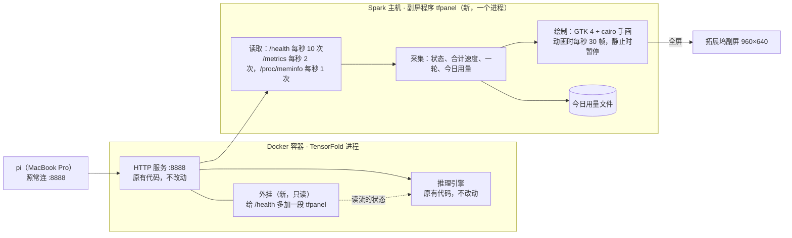
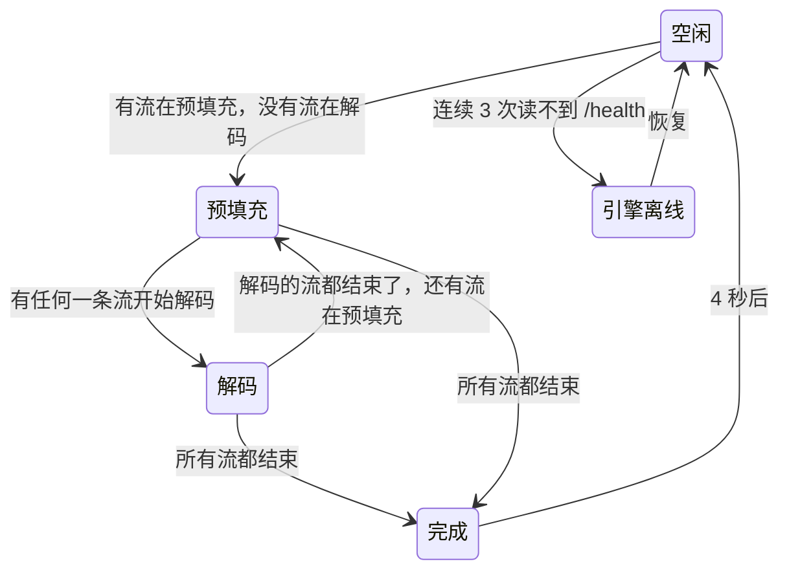

# TensorFold 副屏性能仪表盘 · 设计文档（第 2 版 · DGX Spark）

> 2026-10-04。本文取代第 1 版（Mac Studio 上同进程外挂 + SwiftUI 显示程序，见 git 提交 `6c9ad9a` 里的 `docs/design.md`）。
> 界面的视觉效果和交互细节以同目录下的可交互原型 `dashboard-prototype.html` 为准；本文与原型不一致时，以原型为准并同步修改本文。
> 原型打开方式：直接用浏览器打开；地址后加 `?kiosk=1` 进入只显示屏幕的 Kiosk 模式，再加 `&demo=<名字>` 停在某个画面（名字见原型左侧面板）。
> 原型已于 2026-10-04 确认（在 Spark 副屏上看过实物效果），可以开始实现。各画面的副屏实拍截图在 `docs/prototype-shots/`。

## 背景与目标

第 1 版的前提是：TensorFold、模型、副屏都在同一台 Mac Studio 上，同一时刻只有一个请求。现在全部变了：

| 项目 | 第 1 版 | 现在 |
| --- | --- | --- |
| 推理机器 | Mac Studio（M5 Max，MLX） | DGX Spark（CUDA），TensorFold 跑在 Docker 容器里 |
| 模型 | Qwen3.8-27B | Qwen3.8 Flash Next（支持图片、视频输入） |
| 并发 | 1 | 最多 5 条流同时解码 |
| 副屏接在哪 | Mac Studio | Spark 的 C 口 |
| 客户端 | 本机 | MacBook Pro 上的 pi，直连 Spark 的 8888 端口 |
| Mac Studio | 全部 | 完全退出 |

目标不变：让拓展坞上那块 3.5 英寸副屏实时显示本地模型的运行状态。这一版在此之上增加：

- 并发：显示当前几条流在解码、几条在预填充、几个在排队，速度按所有流合计。
- 预填充：长预填充时仪表盘显示实时预填充速度和进度。
- 空闲：不再显示上次结果，改为今日用量和按 API 价格折算的今日费用。

本版不做：

- 每条流各自的速度（只显示合计）。
- GPU 功耗、温度（Spark 上不需要管理员权限就能读，以后想加可以加）。
- 在 MacBook Pro 或其他机器上显示。
- 向 TensorFold 上游或部署仓库提交 PR。

## 硬件与环境

以下都是 2026-10-04 通过 `ssh spark` 实测的。

| 项目 | 实测值 |
| --- | --- |
| 机器 | DGX Spark（主机名 `thinkstationpgx-af07`），aarch64，20 核，内存 121 GB（显存与内存共用），NVIDIA GB10 |
| 系统 | Ubuntu 24.04.5，GNOME 跑在 Xorg（X11）上，显示号 `:1`，系统时区 UTC |
| 部署方式 | 部署仓库 `~/Qwen3.8-Flash-Next-Single-DGX-Spark-TensorFold`，`./start.sh` 启动容器 `qwen38-flash-next-tf`（host 网络，root） |
| 推理引擎 | TensorFold 0.6.1 加部署仓库的补丁（镜像 `tensorfold-qwen38:v0.6.1-languages`）；上游最新标签 v0.6.5，版本由部署仓库固定 |
| 启动参数 | `--port 8888 --parallel 5 --context 262144 --kv-dtype int8 --mtp-drafts 6 --vision --thinking` 等 |
| 服务地址 | `http://<spark>:8888/v1`，模型名 `Qwen3.8-Flash-Next`，本机读 `/health`、`/metrics` 不需要密钥 |
| 副屏 | 输出口 `USB-C-0`，EDID 厂商 `DRS`、型号 `TYPE-C`，960×640 @ 60 Hz 是系统首选模式，不需要手动切分辨率 |
| 副屏面板 | 3.5 英寸，960×640 原生，3:2，约 330 PPI，约 74×49 mm（EDID 报的物理尺寸 293×165 mm 是错的） |
| 屏幕组合 | 平时副屏是 Spark 唯一的屏幕；极少数时候会同时接一台 5120×2160 的 HDMI 显示器 |
| 可用工具 | 系统 Python 3.12.3，带 GTK 4.14、cairo、Pango 的绑定；有 Noto Sans CJK SC 字体；没有 Swift、Node |
| 速度参考 | 部署仓库 README：单流散文 63.6 tok/s；4 路并发合计 114.5 tok/s（每路 29.7）。本次实测：单流 59.7 tok/s；24,615 token 从头预填充 10.4 秒，即 2,372 tok/s |

界面仍按 **480×320 pt、2 倍像素**设计。GNOME 对这块屏的缩放是 1 倍，EDID 的物理尺寸又是错的，所以显示程序自己把全部尺寸乘 2，不依赖系统缩放。

## 整体架构

客户端照常连 8888 端口，什么都不用改。指标尽量从容器外面读 TensorFold 自带的接口；只有预填充进度这类外面读不到的信息，才靠一个很小的容器内外挂补上。



| 组件 | 做什么 | 在哪运行 | 用什么写 |
| --- | --- | --- | --- |
| 外挂 | 在 `/health` 的返回里加一段 `tfpanel`：每条流的阶段、提示长度、缓存命中、预填充进度、已输出 token 数 | 容器里，TensorFold 进程内 | Python，两个文件，以补丁形式放进部署仓库的 `patches/` |
| 采集 | 读接口，算出状态、合计速度、预填充速度、一轮统计、今日用量和费用 | Spark 主机 | Python 标准库 |
| 绘制 | 找到副屏，全屏画仪表盘 | Spark 主机，和采集同一个进程 | Python + GTK 4 + cairo + Pango（系统自带） |

采集和绘制放在一个进程里，中间用一份“指标快照”（见下文）交接。快照的格式固定下来，测试和离屏截图都用它。

## 数据来源

### TensorFold 自带的 `/health`（主要来源，已实测）

每 0.1 秒读一次，平均 2 毫秒一次。返回示例：

```json
{"ok": true, "backend": "tensorfold", "busy": true, "requests_running": 1, "requests_total": 98,
 "prompt_tokens_total": 8260391, "completion_tokens_total": 185305, "prefill_seconds_total": 1457.42,
 "decode_seconds_total": 2851.45, "cached_tokens_total": 5443627, "rounds_total": 60827,
 "drafted_total": 178502, "accepted_total": 124381,
 "streams": {"decoding": 1, "prefilling": 0, "max": 5}, "context_length": 262144}
```

- `completion_tokens_total` 包含正在生成的请求已经输出的 token，解码过程中实时增长（实测 0.3 秒 4 个、1.2 秒 58 个、3.4 秒 187 个）。实时速度就是它的增长率。
- 其余累计值只在请求结束时增加。一个请求结束前后的差就是这个请求的精确成绩（实测：提示 58、输出 200、预填充 0.0824 秒、解码 3.3507 秒、草稿 171 接受 116，和接口返回的 `usage` 一致）。
- `streams` 给出正在解码、正在预填充的流数和上限。
- 累计值从模型启动算起，模型重启就归零。

### TensorFold 自带的 `/metrics`（辅助，已实测）

Prometheus 文本格式，每 0.5 秒读一次，只用三项：

- `tensorfold:requests_waiting`：排队的请求数。
- `tensorfold:kv_cache_usage_ratio{pool="i"}`：每条流的占用 ÷ 上下文上限。预填充期间它等于“提示长度 ÷ 上限”（实测 0.093899 × 262144 = 24,615，正好是提示长度），解码期间随输出增长。外挂失效时用它画上下文条。
- `tensorfold:time_to_first_token_seconds_sum` 和 `_count`：请求结束前后的差是这个请求的首字时间。

### 容器内外挂（只负责外面读不到的）

外面读不到三样东西：预填充开始时的缓存命中、预填充进度、每条流各自的输出。外挂在 `/health` 的返回里追加：

```json
"tfpanel": {"v": 1, "streams": [
  {"id": 3, "phase": "decode",  "prompt": 18420, "cached": 16384, "output": 312},
  {"id": 4, "phase": "prefill", "prompt": 24615, "cached": 2048,  "filled": 10240}
]}
```

| 字段 | 含义 | 引擎里的来源（TensorFold 0.6.1，`tensorfold/families/qwen4_exp/cuda/multi.py`） |
| --- | --- | --- |
| `phase` | `prefill` 或 `decode` | 流在 `decoder.filling` 列表里还是 `decoder.streams` 字典里 |
| `prompt` | 提示 token 数 | `len(stream.prompt)` |
| `cached` | 从缓存复用的 token 数 | `stream.cached`（`_slot_for` 查完缓存后写入） |
| `filled` | 预填充已经算到提示的第几个 token | `decoder.fills[sid][2]`，引擎每算完一块（最多 2048 个 token）更新一次 |
| `output` | 已输出 token 数 | `len(stream.out)` |

做法（已在一次性容器里验证，没有碰正在运行的模型）：

- 补丁只新增两个文件，不改 TensorFold 任何已有文件，所以永远打得上，不会让镜像构建失败：
  - `tfpanel_hook.pth`：一行 `import tfpanel_hook`，Python 启动时自动执行。
  - `tfpanel_hook.py`：登记一个导入钩子，等 `tensorfold.cuda.health` 第一次被导入后，把 `Health.snapshot` 包一层，在返回值里加 `tfpanel`。
- 启动时不导入 torch，不拖慢 `tensorfold --version` 这类命令（实测导入耗时 0.00 秒）。
- 只读：只读几个列表的长度和几个整数，不加锁、不调用引擎的任何方法，和 `/health` 自己读 `decoder.streams` 的方式相同。
- 外挂内部出任何错都吃掉，`/health` 照常返回，只是没有 `tfpanel` 这一段。

还没验证的部分：这些字段在真实运行的引擎里的取值是否符合上表。验证需要带外挂重启一次模型，放在实现阶段做。

验证时用的三个文件留在 `docs/spike-hook/`（外挂的两个文件和一个检查脚本），只是验证用的草稿，不是正式实现；正式的外挂按任务说明另写。验证命令：在 Spark 上把 `.pth` 和 `.py` 挂进一次性容器的 `/usr/local/lib/python3.12/dist-packages/`，用 `docker run --rm --entrypoint python3 … tensorfold-qwen38:v0.6.1-languages /check.py` 运行检查脚本（不用显卡）。

### 其他

- 内存：读 Spark 的 `/proc/meminfo`，已用 = `MemTotal − MemAvailable`，每秒一次。
- 时间：今日按太平洋时间（`America/Los_Angeles`）划分，用 Python 的 `zoneinfo`，不改系统时区。

### 每个指标从哪来

| 指标 | 来源 | 需要外挂 | 精度 |
| --- | --- | --- | --- |
| 解码、预填充、排队的流数 | `/health` 的 `streams`，`/metrics` 的排队数 | 否 | 精确，0.1 秒内更新 |
| 合计解码速度 | `completion_tokens_total` 最近 2.5 秒的增长率 | 否 | 精确 |
| 峰值 | 平滑后合计速度的最大值（解码开始 1 秒后才计） | 否 | 同上 |
| 单个请求的最终速度、输出、缓存命中、接受率 | 请求结束前后累计值的差 | 否 | 精确；几个请求在同 0.1 秒内结束时合成一笔 |
| 首字时间 | 解码中：采集器看到第一个 token 的时刻；结束后：`/metrics` 直方图的差 | 否 | 解码中误差 ≤ 0.1 秒，结束后精确 |
| 提示长度、上下文占用 | 外挂的 `prompt`、`output`；外挂失效时用 `/metrics` 的占用比 | 否 | 精确 |
| 预填充开始时的缓存命中 | 外挂的 `cached` | 是 | 精确 |
| 实时预填充速度、进度、剩余时间 | 外挂的 `filled` 的变化 | 是 | 每算完一块更新一次，约 0.9 秒一次 |
| 平均预填充速度（请求结束后） | （提示 − 缓存命中）÷ 预填充秒数 | 否 | 精确 |
| 今日用量、费用 | 累计值的增量，按天记到文件 | 否 | 精确，条件见“今日统计与费用” |
| 内存 | `/proc/meminfo` | 否 | 和系统监视器一致 |

## 状态与并发规则

副屏显示的是整台机器，不是某一个请求。每个数字要么是所有流的合计，要么是这一轮的累计。



| 画面元素 | 规则 |
| --- | --- |
| 状态 | 有任何一条流在解码就是“解码中”；没有解码、有预填充才是“预填充中”；全部结束才是“完成” |
| 仪表盘速度 | 解码中：所有正在解码的流的合计速度（2.5 秒平滑） |
| 预填充速度 | 只在“预填充中”状态显示，是所有正在预填充的流的合计 |
| 等待时间 | 只在“预填充中”状态显示，从最早那条还在预填充的请求开始算 |
| 上下文占用条 | 占用最大的那条流 |
| 完成画面 | 所有流都结束时才出现；中途某一条结束不切画面，它的成绩并入本轮累计 |
| 峰值 | 合计速度的峰值 |
| 流指示点 | 状态条最左边 N 个小圆点（N = 流数上限，现在是 5），从左到右依次是解码中的（绿）、预填充中的（琥珀）、空着的（灰）；有排队时后面写“+2” |

说明：

- 混合状态（有的在解码、有的在预填充）下圆圈显示解码合计，看不到预填充速度；预填充的存在靠流指示点里的琥珀色点和状态条文字体现。
- 同时有 2 个请求就满足“本轮请求 ≥ 2”，所以并发时一定处在一轮模式，完成画面就是本轮统计。单请求的完成画面保持第 1 版的样子。
- 模型加载期间 `/health` 读不到，和离线分不开，所以去掉第 1 版的“启动中”状态，统一显示“引擎离线”。
- 第 1 版的“指标不可用”整屏状态也去掉：外挂失效时副屏照常工作，只是预填充画面降级（见“外挂的安装、自检与降级”）。

## 连续请求（一轮）与短预填充

沿用第 1 版的规则，按并发做了三处调整。

- **一轮**：上一个请求结束后 60 秒内来的新请求算同一轮；有请求在进行时来的新请求也算同一轮。阈值可在配置里改。
- **一轮模式**：本轮请求数（含进行中的）≥ 2 时，右侧三栏固定为“本轮请求 / 累计输出 / 本轮平均”，标签在本轮内不变。
- **短预填充**：预填充的前 3 秒画面不变，只有状态条变成“预填充中 · 已用时 x.x s”。超过 3 秒才切成预填充画面。
- **提前切换**：预计预填充要 3 秒以上，或判定为缓存未命中时，一开始就切。预计秒数 = 新算 token 数 ÷ 最近的平均预填充速度（采集器用已完成请求的“新算 ÷ 预填充秒数”滚动更新，初始值 2,300 tok/s）。这一条需要外挂，外挂失效时只按 3 秒切。

调整：

1. **本轮平均的算法**。第 1 版是“各请求输出之和 ÷ 各请求解码秒数之和”。并发时这个算法得到的是单条流的速度（4 路并发约 30 tok/s），和仪表盘上的合计速度（约 114 tok/s）对不上。现在分两种情况：
   - 本轮从头到尾没有两条流同时在跑：仍用第 1 版的算法，全部来自引擎成绩，是精确值，带“精确”标记。
   - 本轮出现过并发：本轮输出 ÷ 本轮里“至少有一条流在解码”的总时长（采集器按 0.1 秒一格累计），不带“精确”标记。
2. **缓存未命中的判定**只在没有出现过并发的一轮里做。并发的几个请求各有各的对话，拿“上一个请求的提示”来比会误报。判定条件和第 1 版相同：本轮上一个完成的请求提示 ≥ 4000；这次提示不短于它的一半；这次命中不到它的一半；这次新算 ≥ 4000。
3. **一轮结束后**切到今日统计，不再显示“上轮”画面（见下文）。

## 今日统计与费用

空闲画面改成今日用量。

- **记账方式**：采集器每次读到累计值，就把相对上次的增量加到当天的账上，并把账和“上次读到的累计值”一起写进 `~/.local/state/tfpanel/usage.json`（有变化时最多每 10 秒写一次，退出时再写一次）。
- **模型重启**：读到的累计值比上次小，说明模型重启过，这次读到的值整个算作增量。
- **副屏程序没在运行**：重新启动后按文件里“上次读到的累计值”补上这段时间的增量。如果这期间模型也重启过，这段用量补不回来。
- **换日**：太平洋时间 0 点，当天的账清零，前一天的合计追加到 `~/.local/state/tfpanel/usage-history.jsonl`。
- **费用**：按下表计算，价格写在配置文件里，可以改。

| 项目 | 单价（每百万 token） | 用量 |
| --- | --- | --- |
| 输入 | $0.15 | 提示 token − 缓存命中的 token |
| 缓存命中的输入 | $0.016 | 缓存命中的 token |
| 输出 | $0.47 | 输出 token（含思考） |

价目表里的“显式缓存创建 / 读取”两项用不上，TensorFold 的缓存是自动的。价格不按提示长度分档。

量级参考：模型这次启动后前 14 小时共 98 个请求，输入 826 万（其中缓存命中 544 万）、输出 18.5 万，合计约 $0.60。所以费用显示到美分。

## 指标快照（采集 → 绘制）

采集部分每次读完接口，产出一份快照交给绘制部分。测试用的样例文件（`fixtures/*.json`）就是这种格式。

```json
{
  "version": 2,
  "state": "decode",
  "hook": "ok",
  "model": "Qwen3.8-Flash-Next",
  "context_max": 262144,
  "lanes": { "max": 5, "decoding": 2, "prefilling": 1, "waiting": 0 },
  "decode": { "tps": 112.4, "tps_peak": 131.0, "tps_avg": 108.2, "output_tokens": 312, "ttft_s": 0.31 },
  "prefill": {
    "elapsed_s": 4.2, "prompt_tokens": 24615, "cached_tokens": 2048, "filled_tokens": 10240,
    "tps": 2372.0, "remaining_s": 6.1, "est_s": 9.5, "cache_miss": false
  },
  "context_used": 24615,
  "last": {
    "prompt_tokens": 58, "cached_tokens": 0, "completion_tokens": 200, "decode_tps": 59.7,
    "prefill_tps": 704.0, "ttft_s": 0.08, "acceptance_rate": 0.68, "context_used": 258
  },
  "round": {
    "requests": 11, "running": 3, "output_tokens": 2345, "decode_tps_avg": 62.3,
    "exact": true, "elapsed_s": 183.2, "active": true
  },
  "today": {
    "date": "2026-10-03", "prompt_tokens": 8260391, "cached_tokens": 5443627,
    "completion_tokens": 185305, "requests": 98, "cost": 0.597
  },
  "memory": { "used_gb": 94.2, "total_gb": 121.6 },
  "offline_s": null
}
```

| 字段 | 含义 |
| --- | --- |
| `state` | `offline`、`idle`、`prefill`、`decode`、`done` 之一，按“状态与并发规则”得出 |
| `hook` | `ok`：`/health` 里有 `tfpanel`；`missing`：没有 |
| `lanes` | 流数上限、正在解码、正在预填充、排队的数量 |
| `decode` | 解码中才有，否则为 `null`。`tps` 合计实时速度；`tps_peak` 峰值；`tps_avg` 从解码开始算的平均（满 0.5 秒才有）；`output_tokens` 当前在跑的请求已输出之和；`ttft_s` 首字时间（只有一条流在跑时才有） |
| `prefill` | 有流在预填充时才有，否则为 `null`。数量都是所有正在预填充的流之和。`elapsed_s` 从最早那条算起；`cached_tokens`、`filled_tokens`、`tps`、`remaining_s`、`est_s` 在外挂失效时为 `null`；`tps` 在算完第一块之前为 `null`；`cache_miss` 没有判定时为 `false` |
| `context_used` | 占用最大的那条流的 提示 + 已输出；没有请求在跑时是上一个请求的值 |
| `last` | 上一个已完成的请求，全部是引擎给的精确值；还没有时为 `null` |
| `round` | 当前这一轮，还没有任何请求时为 `null`。`requests` 已完成的请求数；`running` 进行中的请求数；`exact` 为 `true` 表示本轮没出现过并发、`decode_tps_avg` 是精确值；`active` 有请求在跑或最后一次结束不到 60 秒 |
| `today` | 今日（太平洋时间）用量和费用，`date` 是太平洋时间的日期 |
| `offline_s` | 离线时为已离线秒数，否则为 `null` |

## 副屏界面设计

布局不变：上面一条状态条，左边约 2/3 是 270° 圆弧仪表盘和主数字，右边约 1/3 是三栏数据。深色主题，薄荷绿表示解码，琥珀色表示预填充。

```text
┌──────────────────────────── 480 × 320 pt（放大 2 倍 = 960 × 640 像素）────────────────────────────┐
│  ●●●○○ 解码中                                        解码 2 · 预填充 1 · 内存 94.2 / 121 GB       │
│ ┌───────────────── 仪表盘区 ─────────────────┐   ┌──── 数据区 ────┐                              │
│ │        270° 圆弧，刻度随状态切换              │   │ 本轮请求  7 次  │                              │
│ │             解码速度 · tok/s                 │   ├────────────────┤                              │
│ │                  112                         │   │ 累计输出  2.3K  │                              │
│ │             ▬▬▬───────────                   │   ├────────────────┤                              │
│ │          上下文 24.6K / 262K                 │   │ 本轮平均  108   │                              │
│ └──────────────────────────────────────────────┘   └────────────────┘                              │
└────────────────────────────────────────────────────────────────────────────────────────────────────┘
```

### 状态条

- 最左边是流指示点，取代第 1 版的单个状态圆点。解码中的点按 1.4 秒周期脉冲，预填充中的点按 1 秒周期脉冲。离线时只有一个红点。
- 模型名比以前长（`Qwen3.8-Flash-Next`），只在空闲和离线时显示，忙的时候把位置让给右侧文字。
- 右侧文字见下面各状态的表。

### 仪表盘的两套刻度

| 状态 | 刻度 | 圆弧颜色 | 说明 |
| --- | --- | --- | --- |
| 解码、完成、一轮的灰色画面 | 0 / 25 / 50 / 100 / 200 / 300 tok/s，非线性 | 薄荷绿 | 第 1 版上限是 200；并发合计会更高，先放到 300，实测并发峰值后再调 |
| 预填充 | 0 / 600 / 1.2K / 1.8K / 2.4K / 3K tok/s，线性 | 琥珀色 | 单独预填充实测约 2,372 tok/s |
| 今日统计、离线 | 不显示刻度，圆弧只剩暗色底环 | — | |

6 个刻度把 270° 圆弧等分成 5 段。刻度切换时圆弧按位置缓动过去，刻度数字淡入。

### 单个请求时每个状态显示什么

| 状态 | 仪表盘 | 右侧三栏 | 状态条右侧 |
| --- | --- | --- | --- |
| 引擎离线 | “引擎离线 / 等待 TensorFold 响应…”，底环变暗 | 今日费用 / 已离线 / 内存 | 上次模型名 |
| 空闲（今日统计） | 标题“今日费用 · 美元”，主数字 `$0.60`，下方一行“10月3日 · 太平洋时间” | 今日输入（下方“缓存命中 66%”）/ 今日输出 / 今日请求（下方“上次 63.6 tok/s”） | 模型名 · 内存 |
| 预填充（前 3 秒） | 不变，保持之前的画面 | 不变 | 已用时 x.x s |
| 预填充（3 秒后，或预计 ≥ 3 秒） | 标题“预填充速度 · tok/s”，主数字是实时预填充速度，琥珀色圆弧；下方进度条和“已算 10.2K / 24.6K” | 缓存命中 x%（下方“命中 / 提示”）/ 已等待 x.x s（下方“剩余约 x s”）/ 内存 | 新算 x tok |
| 解码 | 标题“解码速度 · tok/s”，主数字是实时速度；下方上下文条 | 输出 / 平均 / 峰值 | 首字 x s · 内存 |
| 完成（停 4 秒） | 标题“平均速度 · tok/s”，引擎精确值，带“精确”标记 | 输出（下方“提示 x tok”）/ 缓存命中 / 接受率 | 首字 x s |

- 预填充速度在算完第一块之前（约 0.9 秒）显示“—”。
- “已等待”那一栏就是第 1 版的“首字”栏的位置。

### 一轮模式（本轮请求 ≥ 2，含并发）每个状态显示什么

右侧三栏始终是“本轮请求 / 累计输出 / 本轮平均”。

| 状态 | 仪表盘 | 状态条右侧 |
| --- | --- | --- |
| 预填充（前 3 秒） | 不变 | 已用时 x.x s |
| 预填充（3 秒后，或预计 ≥ 3 秒，或缓存未命中） | 同单请求的预填充画面 | 已用时 x.x s · 缓存命中 x% · 剩余约 x s；缓存未命中时中间一段换成琥珀色的“缓存未命中” |
| 解码（一条流） | 实时速度 | 首字 x s · 内存 |
| 解码（多条流） | 合计实时速度 | 解码 n · 预填充 n · 排队 n · 内存（为 0 的项不写） |
| 完成（停 4 秒） | 本轮平均，灰色 | 首字 x s（本轮出现过并发时不写） |
| 空闲（本轮未结束） | 本轮平均，灰色 | 内存 |
| 空闲（本轮已结束，60 秒没有新请求） | 切到今日统计 | 模型名 · 内存 |

- 本轮请求：请求数（含进行中的），单位“次”，下方“用时 x 分钟”。
- 累计输出：本轮已完成请求的输出 + 进行中请求已输出的。
- 本轮平均：没出现过并发时只算已完成的请求（精确，解码中不变）；出现过并发时实时变化。

### 什么时候显示今日统计

- 单个请求：完成画面停 4 秒后淡入今日统计。
- 一轮模式：一轮中间的空隙显示本轮统计（灰色），一轮结束（60 秒没有新请求）后才淡入今日统计。这样编程代理两次工具调用之间不会来回切画面。
- 今日统计显示时又来了请求：短预填充不切画面，只有状态条和流指示点变化；进入解码或长预填充才切。

### 字号、格式与动画

- 字号：主数字 96pt；预填充速度（4 位数）用 76pt，今日费用用 68pt；右侧数值 30pt；标签和状态条 13–14pt；全屏没有小于 12pt 的字。
- 字体：Noto Sans CJK SC，数字用等宽数字（Pango 的 `tnum`）。和 Mac 上的 SF Pro + 苹方字形略有不同，已在副屏上看过，可以接受。
- token 数：不到 1,000 显示原值；1,000 以上显示一位小数的 K（6.2K，整千写 6.0K）；10 万以上显示整数 K（262K）；100 万以上显示两位小数的 M（8.26M），1000 万以上一位小数。
- 费用：`$` 加两位小数（`$0.60`）；100 美元以上不带小数。
- 平滑：解码速度取最近 2.5 秒平均；圆弧缓动时间常数 0.4 秒；主数字每秒最多刷新 4 次。预填充速度每算完一块更新一次，数字直接换，圆弧缓动。
- 淡入：中间区域、右侧三栏、状态条各自在内容标签变化时淡入（0.32 秒），标签没变不淡入。完成 → 空闲用 0.8 秒的慢淡入。
- 上下文条：长 120、高 6，下面一行“上下文 已用 / 上限”。占用 < 80% 灰色，80%–95% 琥珀色，≥ 95% 红色。预填充画面里这个位置换成琥珀色的预填充进度条。
- 长时间没请求：空闲超过 30 分钟把画面调暗到 40%，有请求马上恢复。

## 显示程序行为

| 问题 | 做法 | 是否已验证 |
| --- | --- | --- |
| 绘制方式 | GTK 4 的 `DrawingArea` + cairo 手画，文字用 Pango | 简化画面已在副屏上实测 |
| 刷新 | 有动画时每秒 30 帧（预填充、解码期间流指示点一直在脉冲，所以始终 30 帧）；静止时暂停，数据变了才重画 | 实测每秒 30 次约占单核 3.4%–4.4%，静止约 0%，内存约 120 MB |
| 找到副屏 | 按显示器厂商 `DRS` 匹配（X11 下 GDK 报的型号是接口名 `USB-C-0`，不是 `TYPE-C`）；配置里可以改成按接口名匹配。找不到就不开窗口，插上后自动出现 | 厂商名已实测 |
| 同时接了 HDMI 大屏 | 只在副屏上全屏，不在大屏上开任何窗口 | 待实现时验证 |
| 盖住 GNOME 顶栏 | 全屏窗口 | 预览时已实测 |
| 误点 | 窗口不接收点击、不抢键盘焦点，鼠标移到副屏上时隐藏指针 | 待实现时验证 |
| 息屏和锁屏 | 程序运行期间向 GNOME 申请“不要因空闲息屏”；不改系统设置 | 待实现时验证，不行就改系统的空闲时间 |
| 引擎没开 | 连续 3 次读不到 `/health` 显示离线 | |
| 开机自动出现 | 开启 GNOME 自动登录；在 `~/.config/autostart/` 放一个启动项 | 自动登录需要你执行一条带管理员密码的命令 |
| 资源目标 | 空闲时 CPU 接近 0；忙时不超过单核 5%；内存不超过 150 MB | |

读取频率：`/health` 在有请求时每秒 10 次，空闲时每秒 4 次；`/metrics` 每秒 2 次（空闲时不读）；内存每秒 1 次。

## 外挂的安装、自检与降级

设计原则不变：**外挂失效时只影响副屏上的预填充信息，绝不影响推理。**

**安装**：把补丁文件 `0900-tfpanel-hook.patch` 放进部署仓库的 `patches/`，执行 `./start.sh restart`。部署仓库会发现补丁变了，重建镜像再重启容器。

- 镜像不能再用预构建的，改为在本地构建（TensorFold 安装层有缓存）。
- 每次装或改外挂都要重启一次模型，重启期间 pi 用不了。重启只由你或编排者执行，执行者不能重启模型。
- 部署仓库自己的脚本一个字不改；`git status` 会多出一个未跟踪的补丁文件，不影响 `git pull`。

**自检**：外挂包住 `Health.snapshot` 之前先检查它存在；每次生成 `tfpanel` 时读不到预期的字段就整段不输出。

**降级**（`hook` 为 `missing`）：

| 画面 | 降级后的样子 |
| --- | --- |
| 预填充画面 | 标题换回“已用时 · 秒”，主数字是已等待秒数，圆弧不动；右侧（单请求）“输出 — / 首字 — / 内存”；状态条“提示较长，可能需要几秒” |
| 提前切换、缓存未命中提示 | 没有，只按 3 秒切 |
| 上下文条 | 改用 `/metrics` 的占用比，照常显示 |
| 今日统计的状态条 | 内存前面加琥珀色的“外挂未生效” |
| 其他 | 不受影响 |

**TensorFold 升级后**：部署仓库升级 TensorFold 版本时，补丁照样打得上。如果引擎内部改了名字，外挂自己降级，副屏的状态条会出现“外挂未生效”，到时改几行外挂即可。

## 部署与运行

| 东西 | 位置 |
| --- | --- |
| 副屏程序 | Spark 上的 `~/tfpanel/`（从本仓库同步过去） |
| 配置 | `~/.config/tfpanel/config.json`，没有就全用默认值 |
| 今日用量 | `~/.local/state/tfpanel/usage.json`、`usage-history.jsonl` |
| 开机启动项 | `~/.config/autostart/tfpanel.desktop` |
| 外挂补丁 | `~/Qwen3.8-Flash-Next-Single-DGX-Spark-TensorFold/patches/0900-tfpanel-hook.patch` |

配置项和默认值：

| 配置项 | 默认值 |
| --- | --- |
| 接口地址 | `http://127.0.0.1:8888` |
| 副屏匹配 | 厂商 `DRS` |
| 一轮间隔 | 60 秒 |
| 短预填充阈值 | 3 秒 |
| 时区 | `America/Los_Angeles` |
| 价格（每百万 token） | 输入 0.15、缓存命中 0.016、输出 0.47，货币符号 `$` |

## 仓库结构与开发流程

代码在 MacBook Pro 上写，程序在 Spark 上跑。

| 目录 | 内容 |
| --- | --- |
| `docs/` | 本文、原型、任务说明 |
| `panel/` | 副屏程序（Python 包）：读取、采集、今日用量、视图模型、绘制、窗口 |
| `panel/tests/` | 测试，只用标准库 `unittest`。读取、采集、今日用量、视图模型不依赖 GTK，在 MacBook Pro 和 Spark 上都能跑 |
| `hook/` | 外挂的两个文件和生成补丁的脚本 |
| `fixtures/` | 各状态的指标快照样例 |
| `scripts/` | 同步到 Spark、安装启动项、离屏截图；`scripts/dev/` 是在副屏上看原型和截屏的小工具 |

- 绘制部分用 cairo 画到内存图片上就能离屏截图，不需要显示器，通过 SSH 在 Spark 上跑。每个样例截一张 960×640 的图，和原型同一状态的画面逐张比对。
- 第 1 版的 `collector/`（挂进 Mac 上 TensorFold 进程的采集器）和 `display/`（SwiftUI 程序）在新环境下用不上，已于 2026-10-04 从仓库删除，连同配套的 `scripts/build-app.sh`、`install.sh`、`uninstall.sh`、`scripts/icon/` 和 `docs/tasks/` 里的 12 份旧任务说明；`README.md` 已重写。需要时看 git 提交 `6c9ad9a`（旧任务说明的写法可以参考 `git show 6c9ad9a:docs/tasks/A-collector.md`）。
- `AGENTS.md` 已于 2026-10-04 按本文改写。新的任务说明放在 `docs/tasks/`。

### 在副屏上看原型、截副屏的图

实现阶段要拿正式程序的画面和原型逐张比对。原型是网页，在 Spark 副屏上看它的办法（2026-10-04 用过）：

```sh
# 在 MacBook Pro 上：把原型和两个小工具拷到 Spark
ssh spark 'mkdir -p /tmp/tfpanel-preview'
scp docs/dashboard-prototype.html scripts/dev/preview.py scripts/dev/shot.py spark:/tmp/tfpanel-preview/

# 在 Spark 上（通过 ssh）：全屏打开原型的某个画面，再截副屏
export DISPLAY=:1 XAUTHORITY=/run/user/1000/gdm/Xauthority DBUS_SESSION_BUS_ADDRESS=unix:path=/run/user/1000/bus
export WEBKIT_DISABLE_SANDBOX_THIS_IS_DANGEROUS=1 WEBKIT_DISABLE_DMABUF_RENDERER=1
cd /tmp/tfpanel-preview
setsid nohup python3 preview.py "file:///tmp/tfpanel-preview/dashboard-prototype.html?kiosk=1&demo=decode-multi" >/dev/null 2>&1 </dev/null &
python3 shot.py /tmp/tfpanel-preview/shot.png      # 截整个副屏，960×640
```

- 两个 `WEBKIT_` 环境变量缺一不可：不关沙盒起不来，不换渲染方式画面是一片灰。这只是看原型用的，正式程序不用 WebKit。
- `preview.py` 按 Esc 退出；通过 ssh 结束它时用 `pgrep -f "python3 pre[v]iew.py"` 找进程，直接 `pkill -f preview.py` 会把自己的 ssh 命令也杀掉。
- `shot.py` 截的是整个 X 屏幕，正式程序在副屏上全屏时也用它截图。

## 风险与已知限制

| 风险 | 影响 | 应对 |
| --- | --- | --- |
| 外挂字段在真实引擎里和读代码得出的含义不一致 | 预填充速度、进度不对 | 实现阶段带外挂重启一次模型，用长提示对照 `usage` 核实 |
| 预填充速度约 0.9 秒才更新一次 | 数字是一跳一跳的，不连续 | 引擎按块预填充，没法更细；圆弧做缓动 |
| 混合状态看不到预填充速度 | 有流在解码时，预填充只显示为琥珀色点 | 已接受 |
| 解码刻度上限 300 是估的 | 并发合计超过 300 时圆弧顶满 | 实测并发峰值后调整 |
| 几个请求在同 0.1 秒内结束 | 它们的成绩合成一笔 | 只影响单请求完成画面，并发时本来就显示本轮统计 |
| 副屏程序没运行时模型重启 | 这段时间的今日用量丢失 | 已接受 |
| 自动登录后钥匙串未解锁 | 个别程序可能在副屏上弹“解锁钥匙串”的对话框 | 遇到再处理 |
| 息屏申请对 GNOME 不生效 | 5 分钟后副屏黑掉 | 改系统的空闲时间和锁屏设置 |
| 副屏同时是 Spark 唯一的屏幕 | 需要操作 Spark 桌面时要先退出副屏程序，或接上 HDMI 大屏 | 提供退出方式（终端命令） |

## 已定事项

| 事项 | 结论 |
| --- | --- |
| 副屏接在哪 | Spark 的 C 口 |
| 容器 | 可以动，用“只加文件的补丁”方式装外挂 |
| 显示程序 | 手画（GTK 4 + cairo），刷新频率照搬第 1 版：动画时每秒 30 帧，静止时暂停 |
| 并发 | 全部按合计显示；有任何一条在解码就算解码中；上下文条显示占用最大的那条 |
| 预填充画面 | 圆圈里显示实时预填充速度；等待时间放到原来“首字”那一栏，一轮模式下放在状态条 |
| 空闲画面 | 今日用量和费用；第 1 版的空闲画面不要了 |
| 价格 | 输入 $0.15、缓存命中 $0.016、输出 $0.47（每百万 token），美元 |
| 今日的时区 | 太平洋时间（洛杉矶） |
| 自动登录 | 开 |
| 干活方式 | 不变：Claude 编排并验收，本地模型通过 pi 执行 |
| 原型 | 2026-10-04 确认 |
| 第 1 版代码 | 删除 |
| 主题 | 深色，不做暖米色 |

## 下一步

1. 确认原型（已完成，2026-10-04）。
2. 删除第 1 版的代码和配套脚本，改写 `AGENTS.md` 和 `README.md`（已完成，2026-10-04）。
3. 拆分任务说明，放在 `docs/tasks/`。
4. 实现外挂，带外挂重启一次模型，核实字段。
5. 实现读取、采集、今日用量（有测试）。
6. 实现视图模型和绘制，逐张和原型比对。
7. 实现窗口、找屏、防息屏、开机启动；开自动登录。
8. 验收。

### 验收标准

- 带外挂和不带外挂时，同一请求的解码速度差异 < 1%，输出内容完全一致。
- 单个请求结束后，副屏上的最终速度、输出、缓存命中和接口返回的 `usage` 完全一致。
- 4 路并发时，副屏的合计速度和用 `/health` 手算的结果一致，流指示点数量正确。
- 长提示预填充时，副屏的预填充进度走到提示长度，结束后的缓存命中和 `usage` 一致。
- 今日输入、输出、费用和 `/health` 累计值的增量一致；太平洋时间 0 点清零。
- 关掉模型，副屏 1 秒内显示离线；重新启动后自动恢复。
- 拔掉再插上拓展坞，副屏自动重新铺满；接着 HDMI 大屏时大屏上不出现任何窗口。
- 去掉外挂，模型照常工作，副屏按“降级”一节显示。
- Spark 重启后不用任何操作，副屏自动亮起并显示仪表盘。
