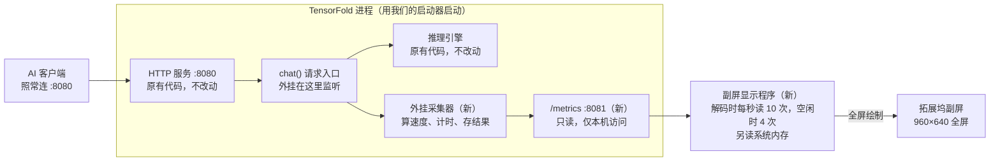
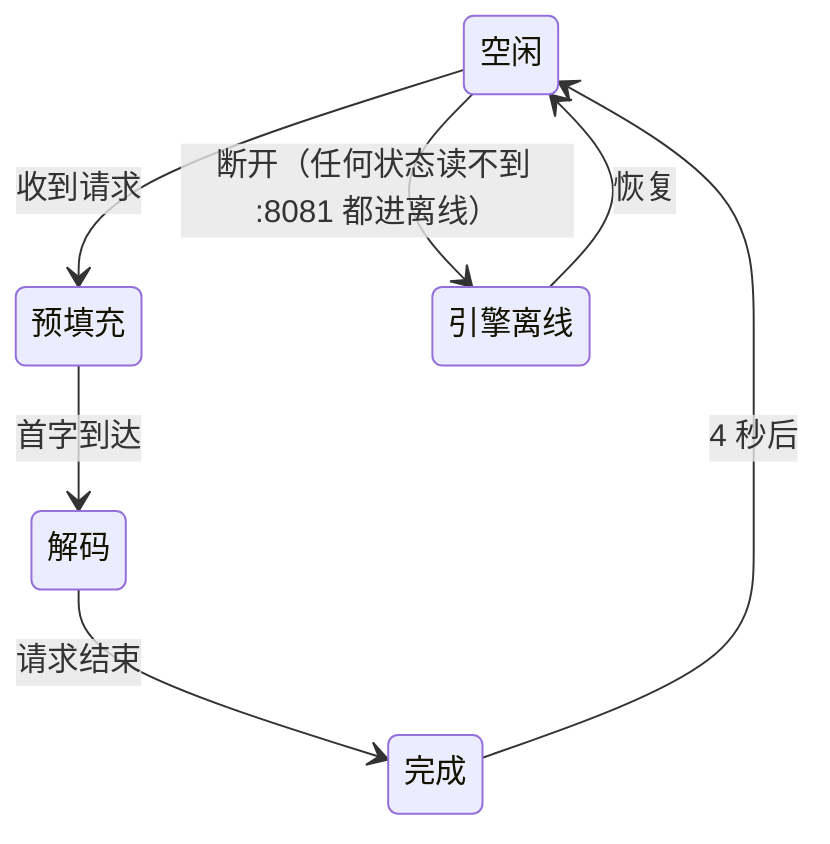

# TensorFold 副屏性能仪表盘 · 设计文档（第 1 层）

> 本文件从云端设计文档导出（2026-09-27），云端原文：https://claude.ai/code/artifact/0ae29857-9306-46f4-bc23-3519265edb35
> 界面的视觉效果和交互细节以同目录下的可交互原型 `dashboard-prototype.html` 为准；本文与原型不一致时，以原型为准并同步修改本文。
> 原型打开方式：直接用浏览器打开；在文件地址后加 `?kiosk=1` 进入只显示屏幕的 Kiosk 模式。

Sep 27, 2026 · @Yyh

## 背景与目标

目标是让拓展坞自带的 3.5 英寸副屏实时显示本地模型的运行状态，最主要的是解码速度。灵感来自 MTPLX 客户端的仪表盘，但 MTPLX 用的是它自带的推理运行时，读不到 TensorFold 的数据，所以要自己做。

**这一版只做“第 1 层”**：在 TensorFold 处理请求的入口 `chat()` 外面挂监听，不改 TensorFold 任何源码。

本版包含：

- 外挂采集器：和 TensorFold 同进程运行，计算指标，提供本地 `/metrics` 接口
- 副屏显示程序：全屏铺满拓展坞屏幕，每秒刷新约 10 次
- 升级自检：TensorFold 更新后自动检查挂载点，失效时降级而不影响推理

本版不做：

- 预填充精确进度和剩余时间（属于第 2 层，设计见文末附录，以后按需再加）
- GPU 功耗、温度（需要管理员权限，暂不做）
- 多路并发的汇总显示（当前 `max_batch_size` 为 1）
- 修改 TensorFold 源码，或向上游提交 PR

## 硬件与环境

以下数据都是 2026-09-27 在这台 Mac 上实测的。副屏在 macOS 里就是一块普通的 DisplayPort 显示器，不需要厂商驱动或 SDK。

| 项目 | 实测值 |
| --- | --- |
| 电脑 | Apple M5 Max，64 GB 内存 |
| 推理引擎 | TensorFold 0.3.4.x，用 `uv tool` 安装 |
| 启动命令 | `tensorfold serve Vontra/Qwen3.8-27B-MLX-4bit`（未加 `--context`） |
| 服务地址 | `http://127.0.0.1:8080`，`max_batch_size` = 1 |
| 上下文上限 | 262,144 tokens（模型配置默认值） |
| 副屏系统名 | TYPE-C（EDID 厂商 DRS，DP 1.2） |
| 副屏面板 | 960×640 原生，3:2，约 330 PPI，约 74×49 mm |
| 当前显示模式 | 960×540 HiDPI（16:9，比例不对） |
| **推荐显示模式** | **960 × 640**（系统设置里直接选，1 倍模式，正好等于面板像素） |

当前的 960×540 模式实际按 1920×1080 渲染，再被压到 960×640 的面板上，所以界面只占中间一块，还会稍微拉伸。系统里还有一个隐藏的 480×320 HiDPI 模式，像素效果和 960 × 640 完全一样，但设置里选不到，所以不用它。

界面按 **480×320 pt、2 倍像素**设计。屏幕这么小但像素很密，要靠大字号和少元素保证一眼能读。

拓展坞论坛页面是 JavaScript 渲染的，没有抓到内容；上面已确认是标准显示器，不影响设计。

## 整体架构

客户端照常连 8080 端口，什么都不用改。采集器跟 TensorFold 跑在同一个进程里，把算好的指标放在 8081 端口，副屏程序只负责读和画。



| 组件 | 做什么 | 用什么写 |
| --- | --- | --- |
| 启动器（命令名 `tfpanel`） | 代替 `tensorfold serve` 命令：先装好外挂，再照常启动 TensorFold，参数原样传进去 | Python，跑在 TensorFold 自己的 Python 环境里 |
| 外挂采集器 + `/metrics` | 监听每个请求，算出状态和指标，在 `127.0.0.1:8081` 提供只读数据 | Python，和启动器同一个文件 |
| 副屏显示程序 | 找到副屏，全屏显示仪表盘；引擎没开时显示“离线” | SwiftUI（macOS 原生小程序，不占 Dock） |

## 数据采集（第 1 层）

采集器用自己的函数包住 TensorFold 的 `chat()`，原来的函数照常执行。从第一个版本到现在，`chat()` 的参数没变过，它能看到三件事：请求什么时候开始、模型逐段输出的文字（`on_delta` 回调）、请求结束时引擎给的成绩单。



- 空闲：显示上次结果
- 预填充：计时，不显示进度
- 解码：实时速度
- 完成：引擎的精确成绩
- 引擎离线：TensorFold 没在运行

每段文字到达时，采集器只记下文字和时间（微秒级）。换算 token 的计算放在自己的线程里，最多每秒 10 次，不拖慢推理。

### 每个指标怎么算

| 指标 | 什么时候有 | 怎么算 | 精度 |
| --- | --- | --- | --- |
| 状态 | 始终 | 按上图的规则切换 | 精确 |
| 预填充已等待 | 预填充中 | 当前时间减去请求开始时间 | 精确 |
| 首字时间 | 解码开始后 | 第一段文字到达时间减去开始时间；结束后换成引擎的 `time_to_first_token` | 误差 ≤ 10 ms |
| 实时解码速度 | 解码中 | 用模型自己的分词器把已输出文字换算成 token 数，取最近 2.5 秒的平均 | 误差 < 1% |
| 输出 tokens | 解码中 | 同上；结束后换成引擎的 `completion_tokens` | 误差 < 1%，结束后精确 |
| 峰值 | 解码中 | 本次请求中平滑后速度的最大值 | 同实时速度 |
| 本次平均速度 | 解码中，完成后换成精确值 | 首字之后的输出 tokens 除以首字之后经过的时间，和引擎算法相同；完成后换成引擎的 `tokens_per_second` | 解码中误差 < 1%，完成后精确 |
| 输入 tokens、缓存命中 | 完成后 | 引擎的 `prompt_tokens`、`cached_tokens` | 精确 |
| 草稿接受率 | 完成后 | 引擎的 `accepted / drafted` | 精确 |
| 上下文用量 | 完成后 | 输入 + 输出，除以 262,144 | 精确 |
| 内存 | 始终 | 副屏程序直接读 macOS 的已用内存 | 和活动监视器一致 |

### 实测：换算值和引擎精确值对比

2026-09-27 对本机正在运行的引擎各发一个请求：

| 请求 | 输出 tokens（精确 / 换算） | 解码速度（精确 / 换算） | 首字时间（精确 / 实测） |
| --- | --- | --- | --- |
| 中文散文 | 570 / 567 | 58.2 / 57.9 tok/s | 0.457 / 0.467 s |
| Python 代码 | 600 / 598 | 109.6 / 109.3 tok/s | 0.102 / 0.103 s |

差的 2 到 3 个 token 应该是思考标签、结束符这类不输出文字的 token。

按 1 秒窗口统计时，散文请求的速度在 27 到 192 tok/s 之间跳动。这是推测解码一轮输出多个 token 导致的真实跳动，不是误差，所以实时速度用 2.5 秒窗口。

已知限制：`max_batch_size` 为 1，第二个请求排队时也会显示成“预填充中”，第 1 层区分不了。

## 指标接口

`GET http://127.0.0.1:8081/metrics` 返回一份 JSON，副屏程序在预填充和解码时每秒读 10 次，其他时候每秒 4 次。接口只监听本机地址、只读，不包含任何对话内容。读不到就算引擎离线。

解码中的一份示例：

```json
{
  "version": 1,
  "state": "decode",
  "engine_ready": true,
  "model": "Qwen3.8-27B-MLX-4bit",
  "tensorfold_version": "0.3.4.1",
  "context_max": 262144,
  "hooks": { "chat": "ok" },
  "current": {
    "elapsed_s": 3.21,
    "ttft_s": 0.457,
    "output_tokens": 312,
    "decode_tps": 58.4,
    "decode_tps_peak": 71.2,
    "decode_tps_avg": 57.9
  },
  "last": {
    "prompt_tokens": 22,
    "cached_tokens": 0,
    "completion_tokens": 570,
    "decode_tps": 58.2,
    "ttft_s": 0.457,
    "acceptance_rate": 0.64,
    "context_used": 592,
    "finish_reason": "stop"
  },
  "totals": { "requests": 42, "peak_tps": 189.3, "uptime_s": 3600 }
}
```

| 字段 | 含义 |
| --- | --- |
| `state` | `idle`、`prefill`、`decode`、`done` 之一；“离线”由副屏程序自己判断 |
| `engine_ready` | 已拿到 TensorFold 的 `ChatApp` 实例为 `true`；模型还在加载时为 `false`（副屏显示“启动中”） |
| `hooks` | 启动自检结果：`pending`（模型加载中，自检还没运行）、`ok` 或 `missing`；见“更新与维护” |
| `current` | 当前请求，空闲时为 `null`；这里的 token 数和速度是换算值；`decode_tps_avg` 为本次平均速度（解码满 0.5 秒后才有） |
| `last` | 上一个已完成请求，全部是引擎给的精确值 |
| `totals` | TensorFold 启动以来的累计：请求数、历史峰值、运行时长 |

内存不在这个接口里，由副屏程序直接读系统。将来加第 2 层时只增加字段，不改已有字段，见文末附录。

采集器生成数据时自己出错，接口返回 HTTP 500（空 body），副屏按一次读取失败处理；指标端口 `8081` 可用环境变量 `TFPANEL_METRICS_PORT` 修改。

## 副屏界面设计

屏幕是 3:2 横屏，不照搬 MTPLX “上面仪表盘、下面 5 张卡片”的布局：480pt 宽放 5 张卡片，每张只有约 90pt，放在桌上看不清。改成左边仪表盘、右边三项、底部一条状态条。

```text
┌──────────────────────────── 480 × 320 pt（整体放大 2 倍 = 960 × 640 像素）────────────────────────────┐
│  状态条：解码中 · Qwen3.8-27B · 首字 0.46 s · 内存 21.4 / 64 GB                                         │
│ ┌───────────────── 仪表盘区（约 2/3 宽）────────────────┐   ┌──── 数据区（约 1/3 宽）────┐           │
│ │            270° 圆弧，刻度 0/25/50/100/150/200          │   │ 输出      12.4K tok        │           │
│ │                      解码速度                           │   ├────────────────────────────┤           │
│ │                        58                               │   │ 平均      57.9 tok/s       │           │
│ │                       tok/s                             │   ├────────────────────────────┤           │
│ │                                                        │   │ 峰值      71 tok/s         │           │
│ └────────────────────────────────────────────────────────┘   └────────────────────────────┘           │
└────────────────────────────────────────────────────────────────────────────────────────────────────────┘
标签 ≥ 13pt · 次要数字 ≥ 28pt · 主数字 ≥ 90pt · 四周留白 ≥ 12pt。实际像素级效果以 docs/dashboard-prototype.html 为准。
```

### 每个状态显示什么

| 状态 | 仪表盘主数字 | 右侧三项 | 状态条 |
| --- | --- | --- | --- |
| 引擎离线 | “—”，圆弧灰掉 | 空 | 引擎离线 · 等待 TensorFold 启动 |
| 空闲 | 上次最终速度，灰色 | 输出 / 首字 / 上下文（上次） | 空闲 · 模型名 · 内存 |
| 预填充 | 已等待秒数，圆弧循环扫动 | 上次结果，灰色 | 预填充中 |
| 解码 | 实时 tok/s（2.5 秒平滑） | 输出 / 平均 / 峰值 | 解码中 · 模型名 · 首字 · 内存 |
| 完成（停 4 秒） | 本次平均速度（引擎精确值），带“精确”标记 | 输出 / 缓存命中 / 接受率 | 完成 · 上下文 592 / 262K |
| 启动中（模型加载） | “模型加载中”，圆弧灰掉 | 上次平均 / 运行时长 / 内存 | 启动中 · TensorFold |
| 指标不可用（自检失败） | “指标不可用 · TensorFold 已更新，需要适配”，圆弧灰掉 | 上次平均 / 运行时长 / 内存 | 指标不可用 · 模型名 |

上表离线、空闲两行的右侧三项以原型为准：离线为“上次平均 / 已离线 / 内存”，空闲为“输出 / 首字 / 内存”。

预填充状态不显示百分比和剩余时间，因为第 1 层拿不到，不做假进度。

### 字号、配色与动画

- 字号：主数字 ≥ 90pt，次要数字 ≥ 28pt，标签 ≥ 13pt，全屏没有小于 12pt 的字。
- 字体：SF Pro + 苹方，数字用等宽数字，变化时不左右抖动。
- token 数：不到 1,000 显示原值；1,000 以上显示一位小数的 K（如 6.2K，整千也写 6.0K，计数时宽度不跳）；10 万以上显示整数 K（如 262K）。输出、输入、缓存和上下文用同一规则。
- 配色：原型准备两套主题对比，深色（推荐，放在桌边不抢眼）和暖米色（接近 MTPLX），看完原型再定。
- 仪表盘刻度：0 / 25 / 50 / 100 / 150 / 200 tok/s，前密后疏，58 和 190 都看得清。6 个刻度把 270° 圆弧等分成 5 段（每段 54°），左右镜像对称；前两段各 25 tok/s、后三段各 50 tok/s。
- 平滑：速度取最近 2.5 秒平均；圆弧连续缓动；数字每秒最多刷新 4 次，否则眼睛跟不上。
- 峰值在圆弧上用一个小刻线标出。

## 显示程序行为

副屏程序是一个不占 Dock 的 SwiftUI 小程序，只在副屏上开一个全屏窗口，并在菜单栏放一个小图标用来退出和切换主题。

| 问题 | 做法 |
| --- | --- |
| 找到副屏 | 按屏幕名 `TYPE-C` 匹配（可在设置里改）；找不到就等待，屏幕插上时自动出现，绝不在主屏弹窗 |
| 显示模式 | 副屏接入时，如果不是 960 × 640 就切过去，并把 480×320 的设计整体放大 2 倍铺满（设置里可关掉） |
| 菜单栏占地方 | 窗口层级高于菜单栏，盖住副屏上的菜单栏，占满全部 320pt 高度 |
| 切换桌面空间 | 窗口出现在所有空间，切换桌面时不消失 |
| 误点 | 窗口不接收点击、不抢键盘焦点，不影响主屏操作 |
| 引擎没开 | 连续 3 次读不到 /metrics 就显示离线（空闲时每秒读 4 次，约 0.75 秒；预填充和解码时每秒读 10 次） |
| 长时间没请求 | 空闲超过 30 分钟把画面调暗到 40%，有请求马上恢复 |
| 开机启动 | 可选加入登录项 |
| 资源占用 | 目标 CPU < 1%，内存 < 50 MB |

建议在“系统设置 > 显示器 > 排列”里把副屏放在主屏的角落，减少鼠标误入副屏。副屏随主屏一起休眠。

## 更新与维护

TensorFold 更新很快（2026-09-25 到 09-27 发了 7 个版本），所以设计原则是：**外挂失效时只影响副屏，绝不影响推理**。

**启动方式**：原来的 `tensorfold serve …` 换成 `tfpanel serve …`，后面参数原样不变，例如 `tfpanel serve Vontra/Qwen3.8-27B-MLX-4bit`。启动器文件放在 TensorFold 安装目录外面，`tensorfold update` 不会碰到它。

**启动自检**：

1. 检查 `ChatApp.chat` 还在，并且仍接受 `on_delta` 参数。
2. 通过：挂上监听，`hooks.chat` 为 `ok`。
3. 不通过：不挂监听，终端打印一行提示，`hooks.chat` 为 `missing`；TensorFold 照常运行，副屏显示“指标不可用 · TensorFold 已更新，需要适配”。

**运行中的保护**：

- 外挂只把原来的 `chat()` 原样调用一次，参数、返回值、报错都原样传递。
- 采集器自己出任何错都在内部吃掉，只记日志，不会让请求失败。
- 成绩单里某个字段被改名或删掉时，只有这一项显示“—”，其他照常。

**实际维护是什么样**：

- 大多数更新：什么都不用做。
- 副屏出现“指标不可用”：把终端里那行提示发给 Claude，一般改几行就能修好。
- 急着用：先退回上一个能用的 TensorFold 版本，一条命令，到时按版本号给出。

## 风险、已定事项与下一步

原型已于 2026-09-27 确认，待定项全部定下，可以开始实现第 1 层。

### 风险与已知限制

| 风险 | 影响 | 应对 |
| --- | --- | --- |
| 采集器抢占 Python 资源，拖慢解码 | 解码变慢 | 换算最多每秒 10 次；验收时对比开关外挂的速度 |
| 客户端用非流式请求 | 没有实时速度，只显示“预填充”再直接跳到“完成” | 接受；大多数聊天和编程工具用流式 |
| 第二个请求排队 | 排队也显示成“预填充中” | 接受，第 2 层才能区分 |
| TensorFold 改了 `chat()` | 副屏显示“指标不可用” | 启动自检 + 降级，见上一节 |
| 自动切显示模式和手动设置冲突 | 副屏分辨率被改回 | 设置里可关掉 |

### 已定事项

| 事项 | 结论 |
| --- | --- |
| 主题 | 深色（薄荷绿圆弧，琥珀色表示预填充），不做暖米色 |
| 空闲时右侧三项 | 输出 / 首字 / 内存（上次请求的结果） |
| 完成画面停留 | 4 秒，然后淡回空闲 |
| 副屏接入时自动切到 960 × 640 | 自动切，默认开启，菜单栏图标里可以关 |
| 启动命令 | `tfpanel serve <模型>`，参数和 `tensorfold serve` 相同 |
| 平滑窗口 | 2.5 秒（按原型） |
| 原始速度小曲线 | 保留，默认显示（按原型） |
| 内存数据来源 | 整机已用内存，和活动监视器一致 |

### 下一步

1. 可交互原型（已完成）：`docs/dashboard-prototype.html`，模拟所有状态，可以用 Kiosk 模式拖到副屏上看真实效果。
2. 确认原型并定下待定项（已完成，2026-09-27）。
3. 实现启动器、采集器和 `/metrics`。
4. 实现副屏显示程序。
5. 验收。

### 验收标准

- 开启和关闭外挂时，同一请求的解码速度差异 < 1%，输出内容完全一致。
- 副屏上的最终速度、输出 tokens 和引擎返回的 `usage` 完全一致。
- 关掉 TensorFold，副屏 1 秒内显示离线；重新启动后自动恢复。
- 拔掉再插上拓展坞，副屏自动重新铺满，主屏上不出现任何窗口。
- 把自检故意改成失败，TensorFold 照常工作，副屏显示“指标不可用”。

## 附：第 2 层设计（后续，不在本次实现范围）

**本次只实现第 1 层。** 这一节记录第 2 层的设计，让第 1 层的接口和界面提前留好位置；实现第 1 层时不要写第 2 层的代码。

第 2 层同样是外挂、不改 TensorFold 源码，但挂在引擎内部的预填充代码上，所以更新后失效的可能性比第 1 层大。失效时自动退回第 1 层的显示，不影响推理。

### 增加什么

| 能力 | 第 1 层 | 第 2 层 |
| --- | --- | --- |
| 预填充进度 | 只显示已等待秒数 | 已处理 / 总 token 数，例如 2.0K / 3.5K |
| 预填充速度、剩余时间 | 没有 | 有（第一块算完后才显示） |
| 预填充时的缓存命中 | 完成后才有 | 预填充一开始就有 |
| 排队和预填充 | 分不开，都显示“预填充中” | 分开，排队时显示“排队中” |
| 解码中的草稿接受率 | 完成后才有 | 解码中实时显示 |

### 挂载点（已对照 TensorFold v0.3.4.1 核实）

Qwen3.8-27B 不走 `lane_family` 路径（该路径只用于 Nemotron 等模型），预填充走 `LaneEngine.add_stream()` → `LaneEngine.prefill()` → `LaneEngine._prefill_tokens()`。

1. 包住 `LaneEngine.add_stream(stream, cache=, cached_tokens=, …)`：进入即表示“开始预填充”，此前 `chat()` 已调用但还没进来就是“排队中”。总量 = `len(stream.prompt_ids)`，缓存命中 = `cached_tokens`，要算的 = 两者之差。同时拿到 `stream` 对象，解码时读它的 `drafted`、`accepted` 算实时接受率。
2. 在 `_prefill_tokens()` 执行期间包住 `_resolve_stack()` 返回的 `core`：`core` 每处理一块 2048 token 调用一次，每块结束后都会 `mx.eval` 真正算完。所以“第 k 块开始”就说明前 k−1 块已完成，进度误差不超过一块。一次请求可能分几段调用 `_prefill_tokens()`（在检查点处切开），进度按段累加。
3. `lane_prefill` 大于 0 时走 `_lane_prefill_tokens()`，按同样方式处理；v0.3.4.1 默认是 0。

### 指标接口变化

`state` 增加 `queued`；`current` 增加 `prefill_done`、`prefill_total`、`prefill_cached`、`prefill_tps`、`prefill_eta_s`、`acceptance_rate`。其他字段不变，副屏程序没有读到这些字段时按第 1 层显示。

### 界面变化

- 预填充：主数字换成预填充速度（tok/s），圆弧从“来回扫动”改成按进度填充；下方显示“2.0K / 3.5K · 剩余 1.5 s”；右侧显示缓存命中。提示短于一块（2048 token）时，一块就算完了，没有中间进度，仍按第 1 层显示已等待秒数。
- 排队中：新增状态，显示“排队中 · 前面还有 1 个请求”。
- 解码：状态条可以加回“接受率”。

### 自检与降级

启动时检查 `LaneEngine.add_stream`、`LaneEngine._prefill_tokens`、`LaneEngine._resolve_stack` 都在，结果写入 `hooks.prefill`。运行中如果进入了 `add_stream` 却没有收到任何分块回调（例如 TensorFold 把 Qwen 挪到了 `lane_family` 路径），这一项自动关掉，界面退回第 1 层。

### 什么时候做

第 1 层稳定后，如果经常用长提示（粘贴长文档、编程代理带长上下文），预填充动辄几秒以上，再做第 2 层。平时对话预填充在 0.1 到 0.5 秒，第 2 层帮助不大。
